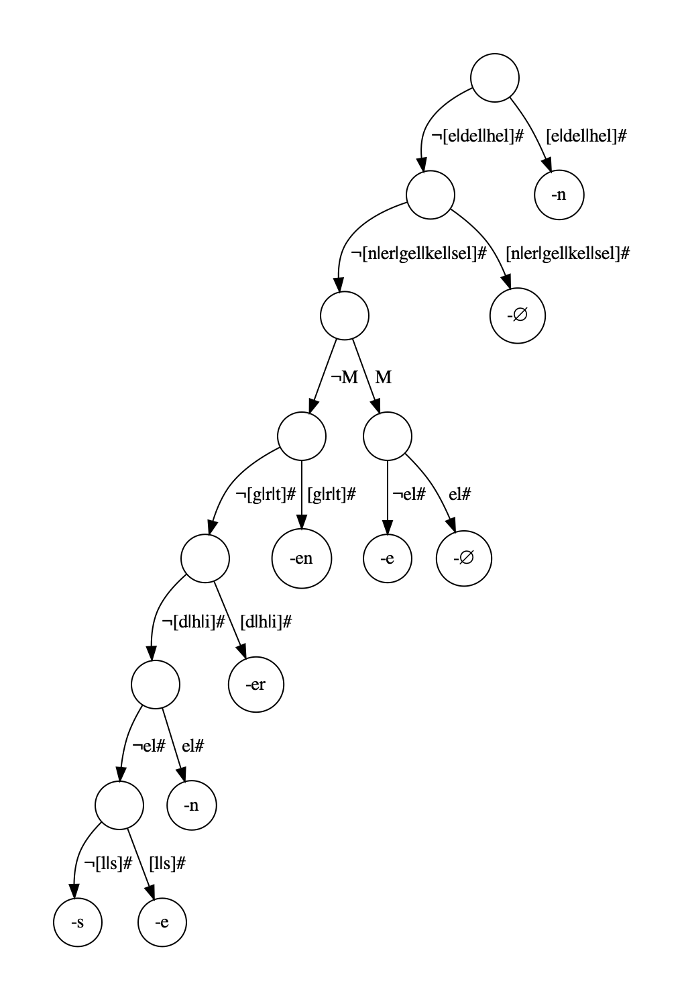

# Abduction of Tolerable Productivity

_The Greedy and Recursive Search for Morphological Productivity._<br>
<a href="https://cbelth.github.io/" target="_blank">Caleb Belth</a>,
<a href="https://paynesa.github.io/" target="_blank">Sarah Payne</a>,
<a href="https://www.denizbeser.org/" target="_blank">Deniz Beser</a>,
<a href="https://jkodner05.github.io/" target="_blank">Jordan Kodner</a>,
<a href="https://www.ling.upenn.edu/~ycharles/" target="_blank">Charles Yang</a>
<br>
CogSci, 2021 [[Link to the paper](https://quickshift.xyz/public/assets/documents/belth-2021-CogSci-ATP.pdf)]

If used, please cite:
```bibtex
@inproceedings{belth21greedy,
  title={The Greedy and Recursive Search for Morphological Productivity.},
  author={Belth, Caleb and Payne, Sarah and Beser, Deniz and Kodner, Jordan and Yang, Charles},
  booktitle={CogSci},
  year={2021}
}
```

## Setup

```bash
$ git clone git@github.com:cbelth/ATP-morphology.git
$ cd ATP-morphology
$ python setup.py
```

To test the setup, run
```bash
$ cd test/
$ python tester.py
```

## Example Usage

Unless stated otherwise, the following examples assume that they are being run from the `src/` directory.

### Train and Inflect

```python
# import code
>> from atp import ATP
>> from utils import load_german_CHILDES
# load some data
>> pairs, feature_space = load_german_CHILDES()
# initialize an ATP model
>> atp = ATP(feature_space=feature_space)
# train ATP
>> atp.train(pairs)
>> atp.inflect('Sache', ('F',)) # ATP produces the correct inflection
'Sachen'
>> atp.inflect('Gleis', ('N',)) # again for a neuter noun
'Gleise'
```

### Inflect without Features

```python
...
>> atp.inflect_no_feat('Sache', ()) # the result is still correct
'Sachen'
>> atp.inflect_no_feat('Gleis', ())
'Gleise'
>> atp.inflect_no_feat('Kach', ()) # for a nonce word with unknown gender, ATP produces the -er suffix, as do a majority of humans
'Kacher'
```

### Training on New Data

Running ATP on new data is simple! All you need to do is create a list of tuples. Each tuple is an instance, and should be ordered `(lemma, inflection, features)`. The `lemma`, and `inflection` should be strings, and `features` a tuple of features, each of which should be included in the `feature_space`. Let's look at an example.

Suppose we have a simple language with just four known lemmas: 'a', 'b', 'c', and 'd,' which oddly can be inflected as either nouns or verbs.

Let's say that nouns are marked with a '-' suffix and verbs with a '+' suffix, with the exception of 'd', which takes '*' as a noun and '**' as a verb.

We can initialize the data as below,

```python
>> pairs = [('a', 'a-', ('Noun',)), 
            ('b', 'b-', ('Noun',)), 
            ('c', 'c-', ('Noun',)),
            ('d', 'd*', ('Noun',)),
            ('a', 'a+', ('Verb',)),
            ('b', 'b+', ('Verb',)),
            ('c', 'c+', ('Verb',)),
            ('d', 'd**', ('Verb',))]
>> feature_space = {'Noun', 'Verb'}
```
and train an ATP model as before,
```python
>> atp = ATP(feature_space)
>> atp.train(pairs)
```
If we then introduce a new lemma 'e', the model that ATP learned correctly inflects it:
```python
>> atp.inflect('e', ('Noun',))
'e-'
>> atp.inflect('e', ('Verb',))
'e+'
```

Moreover, since it has seen the exception 'd' during training, it can still correctly produce its odd suffixes too:
```python
>> atp.inflect('d', ('Noun',))
'd*'
>> atp.inflect('d', ('Verb',))
'd**'
```

### Loading Data From a File

In `utils.py`, the function `load_pairs(path)` will load files of several formats.

The parameter `path` should specify the path to the data that you wish to load.

There are then a number of optional parameters:

<ul>
    <li><code>sep</code> is a string specifying what separates columns. By default it is tab <code>'\t'</code>.</li>
    <li><code>feat_sep</code> is a string specifying what separates features in the feature column. By default it is semicolon <code>';'</code>.</li>
    <li><code>preprocessing</code> is a string-to-string lambda function that allows you to add custom pre-processing to lemmas and inflections. By default, it removes umlauts.</li>
    <li><code>skip_header</code> is a boolean, which, if <code>True</code> skips the first line of the file, treating it as a header. By default it is <code>False</code>.</li>
    <li><code>with_freq</code> is a boolean, which, if <code>True</code>, will return frequencies for each pair (or zero) if no frequencies are given in the file. By default it is <code>False</code>.</li>
</ul>

As an example, we can load one of the files for the English development data, which is saved in orthography, but can be converted to IPA.

```python
>> from utils import load_pairs, load_word_to_ipa
>> word_to_ipa = load_word_to_ipa() # load a dictionary of english word-to-IPA mappings
>> pairs, features = load_pairs('../data/english/growth/child-0/100.txt', sep=' ')
>> pairs[0]
('pretend', 'pretending', ('V', 'V.PTCP', 'PRS'))
>> pairs, features = load_pairs('../data/english/growth/child-0/100.txt', 
                                sep=' ', 
                                preprocessing=lambda s: word_to_ipa[s]) # map every lemma/inflection to its IPA
>> pairs[0]
('pritɛnd', 'pritɛndɪŋ', ('V', 'V.PTCP', 'PRS'))
```

The following row formats are supported:

<ul>
    <li><code>{lemma}{sep}{inflected}{sep}{features}</code></li>
    <li><code>{lemma}{sep}{inflected}{sep}{features}{sep}{frequency}</code></li>
    <li><code>{ignored}{sep}{lemma}{sep}{ignored}{sep}{inflected}{sep}{features}</code></li>
    <li><code>{ignored}{sep}{lemma}{sep}{ignored}{sep}{inflected}{sep}{features}{sep}{frequency}</code></li>
</ul>

An example of each (where `sep = ' '`):

<ul>
    <li><code>sərv sərvd V;PST</code></li>
    <li><code>sərv sərvd V;PST 2674</code></li>
    <li><code>serve sərv served sərvd V;PST</code></li>
    <li><code>serve sərv served sərvd V;PST 2674</code></li>
</ul>

The `{ignored}` columns can be anything and are simply skipped by `load_pairs()`.

### Visualizing a Tree

#### Installing the Visulazation Library

The visualization depends on the libray Graphviz (https://graphviz.org/download/). This requires installation beyond python packages. The way to do this is to follow the official Graphviz instructions for your operating system at https://graphviz.org/download/.

This setup is optional if you do not wish to view any trees.

#### Generating a Tree

ATP constructs a decision tree. These can be automatically generated using the `plot_tree(save_path)` method of ATP.
The tree can be written, as a pdf, to any location. The setup script automatically created a `temp/` directory that
is not checked into git and can be used for this purpose.

The following code will generate and open the tree for the German CHILDES data, or Figure 4 in the paper.

```python
>> from atp import ATP
>> from utils import load_german_CHILDES
>> pairs, feature_space = load_german_CHILDES()
>> atp = ATP(feature_space=feature_space)
>> atp.train(pairs)
>> atp.plot_tree('../temp/german', open_pdf=True)
```


The optional `open_pdf` parameter, if set to `True`, will automatically open the pdf of the tree in your computer's default pdf viewer. If you do not use `open_pdf=True`, then you can navigate on your computer to the location where you saved the pdf and open it from there.

### Running from Command Line

Some of ATP's functionality is available from the command line by treating `atp.py` as a script.

The following command will train ATP on 60 words of German and test it on one of the test sets. The resulting inflections are written—in the same order as the input file—to the specified path `../temp/german_out.txt`.

```bash
python atp.py -i ../data/german/quant/train60_0.txt -t ../data/german/quant/test_0.txt -o ../temp/german_out.txt
```

The full command-line usage is shown below. See the "Loading Data From a File" section for further details on the relevant parameters.

```bash
usage: atp.py [-h] --input INPUT [--test_path TEST_PATH] [--out_path OUT_PATH] [--sep SEP] [--feat_sep FEAT_SEP] [--skip_header SKIP_HEADER]

optional arguments:
  -h, --help            show this help message and exit
  --input INPUT, -i INPUT
                        A path to a dataset of training pairs.
  --test_path TEST_PATH, -t TEST_PATH
                        A path to a dataset of test pairs.
  --out_path OUT_PATH, -o OUT_PATH
                        A path to write the test results to. If None, it will print to stdout.
  --sep SEP, -s SEP     The column seperator for the input file.
  --feat_sep FEAT_SEP, -fs FEAT_SEP
                        The seperator for features in the input file.
  --skip_header SKIP_HEADER, -sh SKIP_HEADER
                        If True, skips the first line of the input file, treating it as a header.
```

### Importing from Other Locations

To import from a location other than `src/`, do the following first:

```python
>> import sys
>> sys.path.append('{path_to_repository}/src')
>> from atp import ATP
```

## Replicating Experiments

To replicate the experiments, see the Jupyter notebook at `notebooks/Experiments.ipynb`.

## Contact

If you have questions, comments, or feedback, please email Caleb Belth at cbelth@umich.edu.